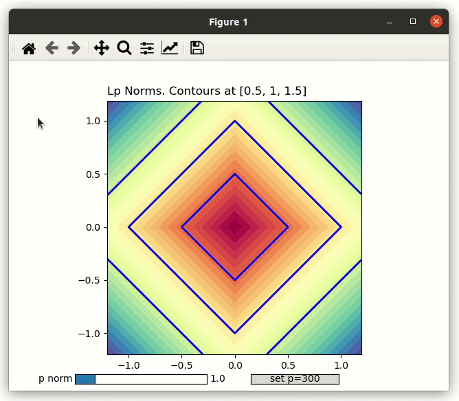

# Refreshers


## Lp norms visualized 

```
Lp_norms.py

Interactive demo with adjustable p, 
showing the shape of the L norm unit-balls
https://en.wikipedia.org/wiki/Lp_space

Mathematically L_inf = argmax(x_1, x_2, ... x_n), but
is visually approximated with L_300 by clicking the button.

Further reading/watching
MIT OpenCourseWare: 8. Norms of Vectors and Matrices
https://www.youtube.com/watch?v=NcPUI7aPFhA
```




- Simplex 
```simplex.py```

- Linear transformations visualised
```linear_transforms.py```

TODO:
- Simplex
- Lasso 
- Total Variation

